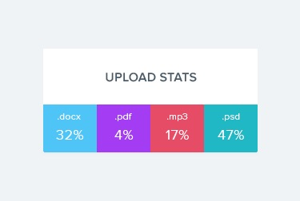

# Профиль социальной сети

Необходимо создать компонент `<Profile>`, с помощью которого мы могли бы
отображать информацию о пользователе социальной сети. Данные о пользователе
лежат в файле [user.json](./src/data/user.json).


## Описание компонента

Компонент должен принимать несколько пропсов с информацией о пользователе:

- `name` — имя пользователя
- `tag` — тег в социальной сети без `@`
- `location` — город и страна
- `avatar` — url на изображение
- `stats` — объект с информацией об активности

Компонент должен создавать DOM элемент следующей структуры.

```html
<div class="profile">
  <div class="description">
    
    <p class="name">Petra Marica</p>
    <p class="tag">@pmarica</p>
    <p class="location">Salvador, Brasil</p>
  </div>

  <ul class="stats">
    <li>
      <span class="label">Followers</span>
      <span class="quantity">1000</span>
    </li>
    <li>
      <span class="label">Views</span>
      <span class="quantity">2000</span>
    </li>
    <li>
      <span class="label">Likes</span>
      <span class="quantity">3000</span>
    </li>
  </ul>
</div>
```

## Пример использования

```js
import user from 'путь/к/user.json;

<Profile
  name={user.name}
  tag={user.tag}
  location={user.location}
  avatar={user.avatar}
  stats={user.stats}
/>
```

# Секция статистики

Создать компонет `<Statistics>`, который бы отображал статистику по переданным
пропам. К примеру загрузки в облако по типу файлов, посещение веб-страницы
пользователями разных стран, финансовые траты и т. п. Данные о статистике лежат
в файле [statistical-data.json](./src/data/statistical-data.json).



## Описание компонента

Компонент должен принимать два пропа `title` и `stats`, в которых указывается
заголовок и объект статистики.

- `title` - не обязателен, и если он не передан, не должна рендериться разметка
  заголовка `<h2>`.
- `stats` - массив объектов содержащих информацию о элементе статистики. Может
  иметь произвольное кол-во элементов.
- Цвет фона элемента статистики в оформлении можно пропустить, либо создать
  функцию для генерации случайного цвета.

Компонент должен создавать DOM элемент следующей структуры.

```html
<section class="statistics">
  <h2 class="title">Upload stats</h2>

  <ul class="stat-list">
    <li class="item">
      <span class="label">.docx</span>
      <span class="percentage">4%</span>
    </li>
    <li class="item">
      <span class="label">.mp3</span>
      <span class="percentage">14%</span>
    </li>
    <li class="item">
      <span class="label">.pdf</span>
      <span class="percentage">41%</span>
    </li>
    <li class="item">
      <span class="label">.mp4</span>
      <span class="percentage">12%</span>
    </li>
  </ul>
</section>
```

## Пример использования

```js
import statisticalData from '/путь/к/statistical-data.json';

<Statistics title="Upload stats" stats={statisticalData} />;
<Statistics stats={statisticalData} />;
```

# Список друзей

Необходимо создать компонент `<FriendList>`, с помощью которого мы могли бы
отображать информацию о друзьях пользователя. Информация о друзьях хранится в
файле [friends.json](./src/data/friends.json).


## Описание компонента FriendList

Компонент должен принимать один проп `friends` - массив объектов друзей.

Компонент должен создавать DOM следующей структуры.

```html
<ul class="friend-list">
  <!-- Произвольное кол-во FriendListItem, в зависимости от кол-ва объектов в массиве -->
</ul>
```

## Описание компонента FriendListItem

Компонент должен принимать несколько пропов:

- `avatar` - ссылка на аватар
- `name` - имя друга
- `isOnline` - буль сигнализирующий о состоянии друга, в сети или нет.

В зависимости от пропа `isOnline`, должен меняться цвет фона `span.status`. Это
можно сделать через разный CSS-класс или Styled Components.

Компонент должен создавать DOM следующей структуры.

```html
<li class="item">
  <span class="status"></span>
  
  <p class="name"></p>
</li>
```

## Пример использования

```js
import friends from 'путь/к/friends.json';

<FriendList friends={friends} />,
```

---

# История транзакций

Необходимо создать компонент истории транзакций в личном кабинете интернет
банка.


Данные для списка доступны в формате JSON в файле
[transactions.json](./src/data/transactions.json). Это массив объектов, каждый
объект описывает одну транзакцию со следующими свойствами:

- `id` — уникальный идентификатор транзакции
- `type` — тип транзакции
- `amount` - сумма транзакции
- `currency` - тип валюты

## Описание компонента

Необходимо создать компонент `<TransactionHistory>` принимающий один проп
`items` - массив объектов транзакций из `transactions.json`. Компонент создает
разметку таблицы. Каждая транзакция это строка таблицы. В примере приведена
разметка двух транзакций.

```html
<table class="transaction-history">
  <thead>
    <tr>
      <th>Type</th>
      <th>Amount</th>
      <th>Currency</th>
    </tr>
  </thead>

  <tbody>
    <tr>
      <td>Invoice</td>
      <td>125</td>
      <td>USD</td>
    </tr>
    <tr>
      <td>Withdrawal</td>
      <td>85</td>
      <td>USD</td>
    </tr>
  </tbody>
</table>
```

## Пример использования

```js
import transactions from 'путь/к/transactions.json';

<TransactionHistory items={transactions} />;
```
